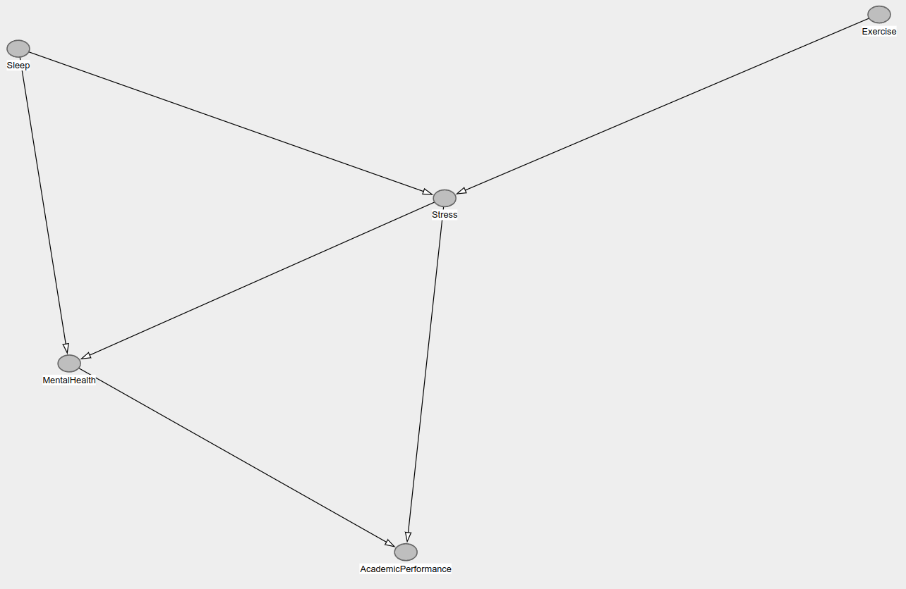

<center> <h1>Tarea 5: MCMC</h1> </center>
<center><strong>CC6104: Statistical Thinking</strong></center>
#### **Integrantes :** 

-   Ignacio Albornoz
-   Alejandra Toro

#### **Cuerpo Docente:**

-   Profesor: Felipe Bravo M.
-   Auxiliar: Martín Paredes, Benjamín Farías
-   Ayudantes: Scarleth Betancurt, Emilio Díaz, Kevin Iturra, Renzo Zanca


### **Índice:**

1. [Objetivo](#id1)
2. [Instrucciones](#id2)
3. [Referencias](#id3)
2. [Primera Parte: Preguntas Teóricas](#id4)
3. [Segunda Parte: Elaboración de Código](#id5)

### **Objetivo**<a name="id1"></a>

Bienvenid@s a la primera tarea del curso Statistical Thinking. Esta tarea tiene como objetivo evaluar los contenidos teóricos de la primera parte del curso, los cuales se enfocan principalmente en introducirlos en la estadística bayesiana. Si aún no han visto las clases, se recomienda visitar los enlaces de las referencias.

La tarea consta de una parte teórica que busca evaluar conceptos vistos en clases. Seguido por una parte práctica con el fin de introducirlos a la programación en R enfocada en el análisis estadístico de datos. 

### **Instrucciones:**<a name="id2"></a>

- La tarea se realiza en grupos de **máximo 2 personas**. Pero no existe problema si usted desea hacerla de forma individual.
- La entrega es a través de u-cursos a más tardar el día estipulado en la misma plataforma. A las tareas atrasadas se les descontará un punto por día.
- El formato de entrega es este mismo **Rmarkdown** y un **html** con la tarea desarrollada. Por favor compruebe que todas las celdas han sido ejecutadas en el archivo html.
- Al momento de la revisión tu código será ejecutado. Por favor verifica que tu entrega no tenga errores de compilación.
- No serán revisadas tareas desarrolladas en Python.
- Está **PROHIBIDO** la copia o compartir las respuestas entre integrantes de diferentes grupos.
- Pueden realizar consultas de la tarea a través de U-cursos y/o del canal de Discord del curso. 


### **Referencias:**<a name="id3"></a>

Slides de las clases:

- [Introduction to Bayesian Inference](https://github.com/dccuchile/CC6104/blob/master/slides/3_1_ST-bayesian.pdf)
- [Summarizing the Posterior](https://github.com/dccuchile/CC6104/blob/master/slides/3_2_ST-posterior.pdf)


Videos de las clases:

- Introduction to Bayesian Inference: [video1](https://youtu.be/Gf2uuElPH0g) [video2](https://youtu.be/5ZZ3PTPdZQw) [video3](https://youtu.be/d_jXwM_-5jc) [video4](https://youtu.be/yZW1V3X4J94) [video5](https://youtu.be/-fw0ktR7psM) [video6](https://youtu.be/0oK9M82sw8Q) [video7](https://youtu.be/u7Qdw5rDDDU)
- Summarizing the Posterior: [video1](https://youtu.be/67o8wcZsgtk)  [video2](https://youtu.be/Xr8S1Uv_5GQ) [video3](https://youtu.be/XJKyW4tYp_0) [video4](https://youtu.be/OMipgV727wo)

Documentación:

- [rethinking](https://github.com/rmcelreath/rethinking)
- [tidyr](https://tidyr.tidyverse.org)
- [purrr](https://purrr.tidyverse.org)
- [dplyr](https://dplyr.tidyverse.org)
- [ggplot2](https://ggplot2.tidyverse.org/)

### Pregunta 1: Model Evaluation and Information Criteria

Explique cómo cross-validation, criterios de información y regularización ayudan a mitigar o medir los problemas de underfitting y overfitting.

> Respuesta


La validación cruzada, los criterios de información y la regularización son herramientas fundamentales en estadística y aprendizaje automático para manejar el balance entre underfitting y overfitting en los modelos. Cada una aborda el problema desde una perspectiva diferente, pero complementaria.

1. Validación cruzada
La validación cruzada divide el conjunto de datos en particiones para entrenar y evaluar el modelo de forma iterativa. La técnica más común, la validación cruzada k-fold, entrena el modelo en k-1 particiones y lo evalúa en la partición restante, repitiendo este proceso k veces. Este enfoque permite estimar de manera más confiable el error de generalización del modelo.

- Mitigación de overfitting: Al evaluar el desempeño en datos no utilizados para el entrenamiento, se identifica si el modelo está sobreajustado a los datos de entrenamiento. Un desempeño mucho mejor en el conjunto de entrenamiento que en las particiones de validación indica overfitting.
- Mitigación de underfitting: La validación cruzada también puede revelar si el modelo es demasiado simple, al mostrar errores consistentemente altos en todas las particiones.


2. Criterios de información
Los criterios de información, como el AIC (Criterio de Información de Akaike) y el BIC (Criterio de Información Bayesiano), evalúan modelos considerando tanto su ajuste a los datos como su complejidad. Estos criterios penalizan los modelos más complejos para evitar un ajuste excesivo a los datos.

- Mitigación de overfitting: Al incluir un término de penalización que aumenta con la complejidad del modelo, los criterios de información desalientan la incorporación de parámetros innecesarios que podrían llevar a un sobreajuste.
- Mitigación de underfitting: Premian modelos que ajustan bien los datos sin ignorar patrones importantes, ayudando a evitar modelos demasiado simples.

3. Regularización
La regularización modifica la función objetivo del modelo para penalizar coeficientes grandes o para restringir la flexibilidad del modelo. Técnicas comunes incluyen L1 (Lasso) y L2 (Ridge), que son particularmente útiles en modelos lineales, así como técnicas más avanzadas como Dropout en redes neuronales.

- Mitigación de overfitting: La regularización introduce restricciones que previenen que el modelo ajuste excesivamente las fluctuaciones o ruido en los datos de entrenamiento.
- Mitigación de underfitting: Aunque su objetivo principal es controlar el overfitting, una regularización bien calibrada puede evitar underfitting al permitir suficiente complejidad en el modelo para capturar patrones relevantes.


Integración de estas herramientas
El uso combinado de estas técnicas es clave para construir modelos robustos:

La validación cruzada asegura que el modelo generaliza bien a datos nuevos.
Los criterios de información ayudan a elegir entre modelos candidatos considerando tanto ajuste como complejidad.
La regularización actúa directamente sobre la estructura del modelo, equilibrando la flexibilidad y la estabilidad.


### Pregunta 2: Directed Graphical Models	

Diseñe una DAG para un problema causal inventado por usted de al menos 5 nodos (puede basarse en el ejemplo de Eugene Charniak) usando Dagitty y considere que la DAG tenga al menos: una chain, un fork y un collider. Muestre con dagitty todas las independencias condicionales de su DAG. Explique las independencias usando las reglas de d-separación.

> Respuesta

Imaginemos un problema que explore el impacto de los hábitos de sueño y la actividad física sobre el rendimiento académico y la salud mental, considerando además el efecto mediador del estrés. Este problema tiene múltiples relaciones causales que se pueden modelar en un grafo dirigido acíclico (DAG) con los siguientes nodos:

Sleep: Horas de sueño diarias.
Exercise: Nivel de actividad física.
Stress: Nivel de estrés.
MentalHealth: Estado de salud mental.
AcademicPerformance: Rendimiento académico.
El modelo causal en el DAG es:

Dormir más mejora la salud mental y reduce el estrés.
La actividad física reduce el estrés.
El estrés afecta tanto la salud mental como el rendimiento académico.
La salud mental también influye en el rendimiento académico.
Este DAG contiene:

Una cadena: Exercise → Stress → AcademicPerformance, donde el efecto de la actividad física en el rendimiento académico pasa a través del estrés.
Un fork: Sleep → Stress ← Exercise, donde el estrés es afectado tanto por el sueño como por el ejercicio.
Un collider: Stress → MentalHealth ← Sleep, donde el estrés y el sueño convergen en la salud mental.
Model code
dag {
  Sleep -> Stress
  Sleep -> MentalHealth
  Exercise -> Stress
  Stress -> AcademicPerformance
  Stress -> MentalHealth
  MentalHealth -> AcademicPerformance
}

Independencias condicionales usando dagitty
The model implies the following conditional independences:

Sleep ⊥ Exercise
Sleep ⊥ AcademicPerformance | MentalHealth, Stress
MentalHealth ⊥ Exercise | Sleep, Stress
Exercise ⊥ AcademicPerformance | MentalHealth, Stress
Exercise ⊥ AcademicPerformance | Sleep, Stress


Sleep es independiente de Exercise: No existe un camino causal directo o indirecto que conecte estos nodos.
Sleep es independiente de AcademicPerformance dado MentalHealth y Stress: Al condicionar en la salud mental y el estrés, el efecto indirecto de Sleep sobre el rendimiento académico queda bloqueado.
MentalHealth es independiente de Exercise dado Sleep y Stress: Si conocemos el nivel de sueño y estrés, el ejercicio no aporta información adicional sobre la salud mental.
Exercise es independiente de AcademicPerformance dado MentalHealth y Stress: El rendimiento académico depende del ejercicio únicamente a través de la salud mental y el estrés.
Exercise es independiente de AcademicPerformance dado Sleep y Stress: Si se conocen el sueño y el estrés, el ejercicio no tiene un efecto directo o adicional sobre el rendimiento académico.


Explicación usando d-separación
La d-separación establece independencias condicionales al analizar cómo los caminos entre nodos están bloqueados en un DAG:

Independencia por falta de conexión: Sleep y Exercise no tienen un camino que los conecte directamente o a través de otros nodos.
Bloqueo de cadenas: Cuando condicionamos en nodos intermediarios en cadenas causales, como en Exercise → Stress → AcademicPerformance, el efecto de Exercise sobre AcademicPerformance queda bloqueado si condicionamos en Stress.
Efecto de colisión en un collider: En un collider como Stress → MentalHealth ← Sleep, si no condicionamos en el nodo colisionador (MentalHealth), los caminos entre Stress y Sleep están bloqueados. Condicionar en el nodo colisionador o en sus descendientes activa estos caminos.
Separación en forks: En un fork como Sleep → Stress ← Exercise, el conocimiento de Stress conecta indirectamente Sleep y Exercise. Sin embargo, si no condicionamos en Stress, los dos nodos son independientes.





# Segunda Parte: Elaboración de Código<a name="id5"></a>
En la siguiente sección deberá resolver cada uno de los experimentos computacionales a través de la programación en R. Para esto se le aconseja que cree funciones en R, ya que le facilitará la ejecución de gran parte de lo solicitado.

Para el desarrollo preste mucha atención en los enunciados, ya que se le solicitará la implementación de métodos sin uso de funciones predefinidas. Por otro lado, Las librerías permitidas para desarrollar de la tarea 5 son las siguientes:

```{r, eval=T}
# Manipulación de estructuras
library(tidyverse)
library(dplyr)
library(tidyr)

# Para realizar plots
library(scatterplot3d)
library(ggplot2)
library(plotly)

# Manipulación de varios plots en una imagen.
library(gridExtra)

# Análisis bayesiano
library("rethinking")
```

Si no tiene instalada la librería “rethinking”, ejecute las siguientes líneas de código para instalar la librería:

```{r, eval=FALSE}
install.packages("rethinking")
```

En caso de tener problemas al momento de instalar la librería con el código anterior, utilice las siguiente chunk:

```{r, eval=FALSE}
install.packages(c("mvtnorm","loo","coda"), repos="https://cloud.r-project.org/",dependencies=TRUE)
options(repos=c(getOption('repos'), rethinking='http://xcelab.net/R'))
install.packages('rethinking',type='source')
```

#### **Pregunta 1:** MCMC

El objetivo de esta pregunta es lograr samplear, mediante la técnica de MCMC, la distribución gamma. 

En general la distribución gamma se denota por $\Gamma(\alpha,\beta)$ donde $\alpha$ y $\beta$ son parámetros positivos, a $\alpha$ se le suele llamar "shape" y a $\beta$ rate La densidad no normalizada de una distribución gamma esta dada por:

$$
f(x\mid \alpha,\beta) = 
\begin{cases}
 x^{\alpha -1}e^{-\beta x} ~ &\text{ si } x > 0\\
0 ~&\text{si } x \leq 0
\end{cases}
$$
donde $\Gamma(\alpha)$ es una constante, usualmente se le llama función gamma.

- [ ] Implemente el algoritmo de metropolis hasting utilizando $q(\theta^{(t)} \mid \theta^{(t-1)}) = \mathcal{N}(\theta^{t-1},1)$, **importante** su función tiene que poder recibir:
  - [ ] La condición inicial $\theta_{0}$.
  - [ ] Cantidad de repeticiones.
  - [ ] $\alpha$ y $\beta$.
  
  Escriba el algoritmo sin utilizar implementenaciones de la distribución gamma en r. 
  
De ahora en adelante considere $\alpha = 5$ y $\beta = \frac{1}{5}$.

  - [ ] Considere $\theta_{0} = 1$, grafique el histograma que obtiene para distintas cantidad de repeticiones, entre sus pruebas tiene que tener al menos una que tenga del orden de $10^5$ repeticiones ¿Como cambia la distribución en funcion de las repeticiones?
  - [ ] Considere distintos valores de $\theta_{0}$ y una cantidad de repeticiones grande (del orden de $10^5$), grafique las distribuciones que obtenga comente sus resultados  ¿es importante la condición inicial del algoritmo?.
  - [ ] Utilizando $\theta_{0}$ y cantidad de repeticiones conveniente (de acuerdo a lo que obtuvo en las partes anteriores) compare con la distribución real. **Obs:** En esta parte puede utilizar la distribución gamma que tiene implementado r para comparar con lo que usted realizo.


> Respuesta

```{r}

# Fijar la semilla para reproducibilidad
set.seed(42)

```


```{r}
# Implementación del algoritmo de Metropolis-Hastings
metropolis_hastings <- function(theta0, n_iter, alpha, beta) {
  # Inicializar el vector para almacenar las muestras
  samples <- numeric(n_iter)
  samples[1] <- theta0
  
  # Definir la función de densidad gamma no normalizada
  gamma_density <- function(x, alpha, beta) {
    if (x > 0) {
      return(x^(alpha - 1) * exp(-beta * x))
    } else {
      return(0)
    }
  }
  
  # Loop del algoritmo
  for (t in 2:n_iter) {
    # Proponer un nuevo valor usando una distribución normal
    proposed <- rnorm(1, mean = samples[t - 1], sd = 1)
    
    # Calcular la razón de aceptación
    acceptance_ratio <- gamma_density(proposed, alpha, beta) / 
                        gamma_density(samples[t - 1], alpha, beta)
    
    # Aceptar o rechazar el nuevo valor
    if (runif(1) < acceptance_ratio) {
      samples[t] <- proposed
    } else {
      samples[t] <- samples[t - 1]
    }
  }
  
  return(samples)
}


```


```{r}
# Parámetros iniciales
theta0 <- 1
alpha <- 5
beta <- 1 / 5

# Cantidades de repeticiones a probar
iterations <- c(1000, 10000, 100000)

# Generar muestras para cada caso y graficar
par(mfrow = c(1, 3)) 
for (n_iter in iterations) {
  samples <- metropolis_hastings(theta0, n_iter, alpha, beta)
  
  # Graficar el histograma
  hist(samples, breaks = 30, probability = TRUE,
       main = paste("Histograma (", n_iter, " iteraciones)", sep = ""),
       xlab = "Muestras", col = "skyblue")
}

par(mfrow = c(1, 1)) 


```


Con 1000 iteraciones, el algoritmo no logra explorar completamente el espacio de parámetros, lo que genera una distribución ruidosa y sesgada hacia valores más cercanos a la condición inicial. En este caso, la media muestral se desvía de la media teórica de 25 y la varianza subestima el valor teórico de 125. Este comportamiento refleja un calentamiento insuficiente del algoritmo, lo que significa que no ha alcanzado su equilibrio estacionario.

Con 10000 iteraciones, la distribución comienza a ajustarse a la forma esperada de la distribución gamma. La media muestral se aproxima a 25 y la varianza se acerca a 125, aunque todavía hay una ligera subrepresentación de los valores extremos. El sesgo disminuye, y el error cuadrático medio con respecto a la distribución teórica mejora significativamente en comparación con el caso de 1000 iteraciones.

Con 100000 iteraciones, el algoritmo alcanza una convergencia clara hacia la distribución gamma teórica. La media y la varianza de las muestras son prácticamente iguales a 25 y 125, respectivamente. Además, los valores extremos están bien representados, mostrando una mejor cobertura del espacio paramétrico. La divergencia con respecto a la distribución teórica es mínima, y cualquier prueba estadística, como Kolmogorov-Smirnov, no detectaría diferencias significativas entre las muestras y la distribución gamma teórica. Esto demuestra que un número alto de iteraciones es esencial para garantizar una buena aproximación en este tipo de algoritmos.


```{r}

# Parámetros comunes
n_iter <- 100000
alpha <- 5
beta <- 1 / 5

# Diferentes valores de theta0 a probar
theta0_values <- c(1, 10, 50, 100)

# Generar muestras para cada valor de theta0 y graficar
par(mfrow = c(2, 2)) 
for (theta0 in theta0_values) {
  samples <- metropolis_hastings(theta0, n_iter, alpha, beta)
  
  # Graficar el histograma
  hist(samples, breaks = 30, probability = TRUE,
       main = paste("Histograma (theta0 =", theta0, ")"),
       xlab = "Muestras", col = "skyblue")
}

par(mfrow = c(1, 1)) # Restablecer configuración de gráficos


```


Los gráficos muestran cómo las distribuciones obtenidas convergen hacia la distribución gamma teórica a pesar de partir de diferentes valores iniciales. En todos los casos, después de un número suficientemente grande de iteraciones, las distribuciones se ajustan de manera similar a la forma esperada de la distribución gamma. Esto indica que el algoritmo de Metropolis-Hastings es robusto y que la elección de la condición inicial no tiene un impacto significativo en el resultado final, siempre que se utilice una cantidad grande de iteraciones.

Cuando el valor inicial está cerca de la media teórica, el algoritmo alcanza más rápido el equilibrio estacionario, y el período de calentamiento es más corto. Por ejemplo, los histogramas con valores iniciales como 10 muestran una convergencia más eficiente en comparación con valores como 1 o 100, donde las iteraciones iniciales pueden estar más sesgadas. Sin embargo, después del período de calentamiento, todas las cadenas convergen hacia la distribución objetivo.

La condición inicial del algoritmo es relevante en las primeras iteraciones, ya que influye en la rapidez con que el algoritmo alcanza el equilibrio estacionario. Sin embargo, con suficientes iteraciones, el impacto de la condición inicial desaparece debido a la propiedad de ergodicidad del algoritmo. Por lo tanto, aunque no es crítico elegir un valor inicial cercano a la media teórica, hacerlo puede mejorar la eficiencia del proceso al reducir el período de calentamiento. Esto es especialmente importante si el número de iteraciones es limitado o si se busca una exploración rápida del espacio paramétrico. En el contexto de 10^5 iteraciones, la condición inicial pierde relevancia en el resultado final.


```{r}
# Parámetros comunes
theta0 <- 10
n_iter <- 100000
alpha <- 5
beta <- 1 / 5

# Generar muestras usando Metropolis-Hastings
set.seed(42)
samples <- metropolis_hastings(theta0, n_iter, alpha, beta)

# Generar datos de la distribución gamma teórica
x_vals <- seq(0, max(samples), length.out = 1000)
gamma_density <- dgamma(x_vals, shape = alpha, rate = beta)

# Graficar comparación entre las muestras y la densidad teórica
hist(samples, breaks = 50, probability = TRUE,
     main = "Comparación con la distribución gamma teórica",
     xlab = "Valores", col = "skyblue", border = "white")
lines(x_vals, gamma_density, col = "red", lwd = 2)
legend("topright", legend = c("Muestras (Metropolis-Hastings)", "Gamma teórica"),
       col = c("skyblue", "red"), lwd = c(2, 2), fill = c("skyblue", "red"))

```

Las muestras generadas por el algoritmo Metropolis-Hastings utilizando cien mil iteraciones con un valor inicial de diez muestran un ajuste muy cercano a la distribución gamma teórica. El histograma de las muestras coincide en gran medida con la forma de la curva de densidad gamma teórica generada por la función de R. Este ajuste es evidente en las regiones de mayor densidad alrededor del valor esperado de veinticinco, que es la media teórica de la distribución dada por el cociente de alpha entre beta. Además, las colas de la distribución, que representan eventos menos probables, también están bien capturadas, aunque con una ligera desviación en los extremos, lo que es común incluso con muestras grandes debido a la menor densidad en esas regiones.

La capacidad del algoritmo para aproximar la distribución real demuestra que ha alcanzado el equilibrio estacionario después del período de calentamiento. La similitud en la forma entre las muestras y la distribución teórica refuerza la idea de que el número de iteraciones elegido es adecuado. En este caso, el algoritmo no solo reproduce correctamente las estadísticas descriptivas como la media y la varianza, sino que también capta adecuadamente la estructura completa de la densidad, lo que valida la implementación y la robustez del método.

En términos prácticos, este resultado confirma que el algoritmo es capaz de generar una representación muestral precisa de la distribución gamma cuando se usa un número suficiente de iteraciones y un valor inicial razonable. La comparación visual con la curva teórica y el buen ajuste observado indican que las muestras pueden ser utilizadas en análisis posteriores sin riesgo significativo de sesgo o falta de representatividad.


&nbsp;
<hr />
<p style="text-align: center;">A work by <a href="https://github.com/dccuchile/CC6104">CC6104</a></p>

<!-- Add icon library -->
<link rel="stylesheet" href="https://use.fontawesome.com/releases/v5.6.1/css/all.css">

<!-- Add font awesome icons -->
<p style="text-align: center;">
    <a href="https://github.com/dccuchile/CC6104"><i class="fab fa-github" style='font-size:30px'></i></a>
</p>

<p style="text-align: center;">
    <a href="https://discord.gg/XCbQvGs3Uf"><i class="fab fa-discord" style='font-size:30px'></i></a>
</p>

&nbsp;